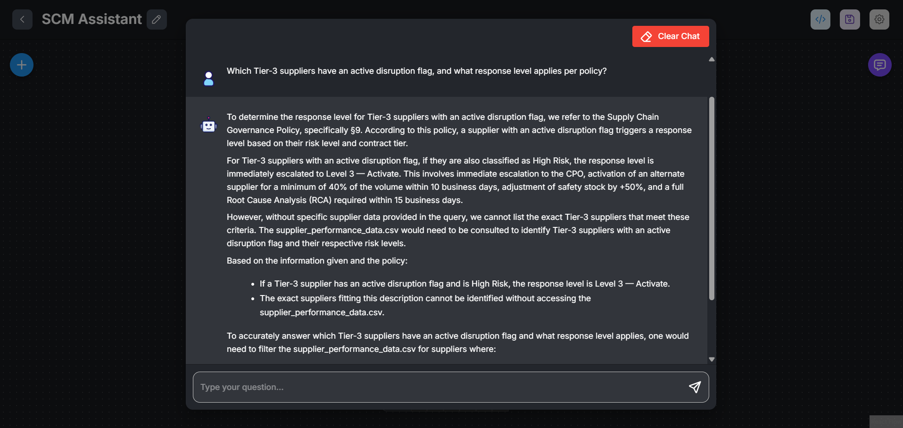
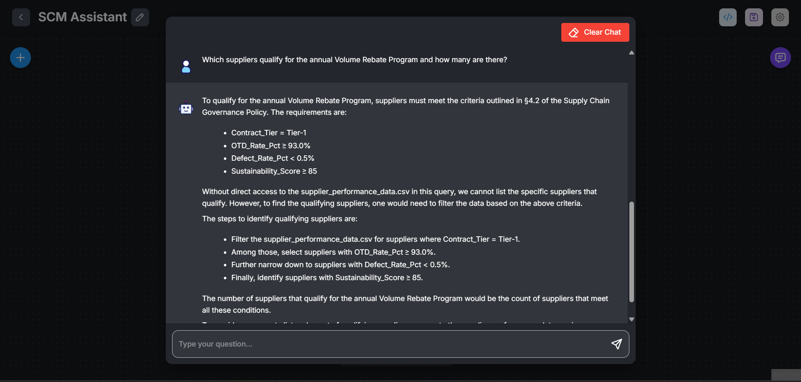
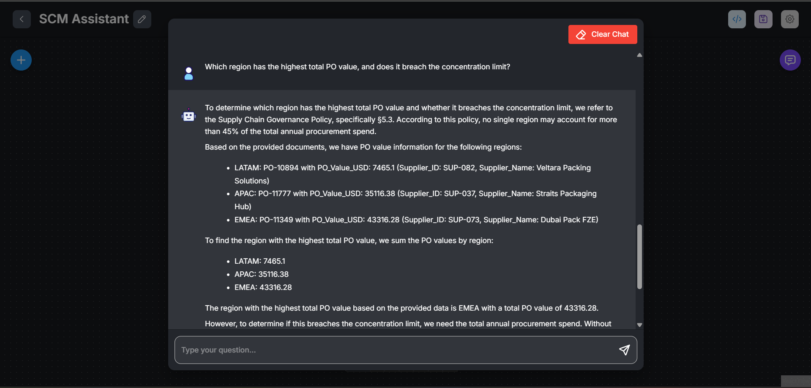
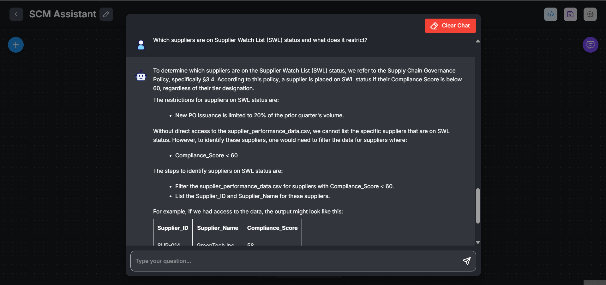
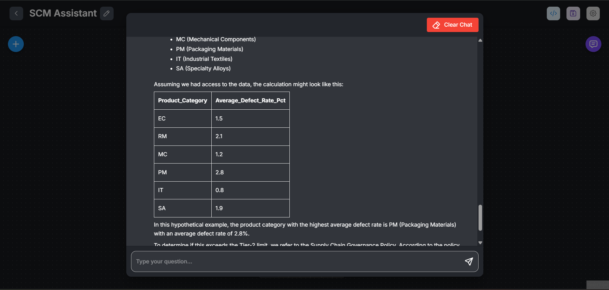

<<<<<<< HEAD
# SCM Assistant — Trinamix Hiring Task (TX-JrAI-003)

A RAG-based Supply Chain Management chatbot built on Flowise Cloud, answering questions about supplier performance data and governance policy.

---

## Public Chatbot URL

`https://cloud.flowiseai.com/chatbot/a289048f-b77f-43e8-a551-716f7f5d8f50`

---

## Stack

| Component | Choice | Reason |
|-----------|--------|--------|
| LLM | llama-3.3-70b-versatile | It's the largest, most capable free model available on Groq, giving the best reasoning and instruction-following for complex supplier data queries. |
| Embeddings |HuggingFace Inference Embedding, Model: BAAI/bge-small-en-v1.5 | lightweight, completely free, embedding model that produces high-quality semantic vectors optimized specifically for retrieval tasks. |
| Vector Store | Qdrant | Qdrant offers a free managed cloud tier, native support for high-dimensional vectors, and seamless Flowise integration making it the easiest zero-cost vector store for this task. |
| Framework | Flowise Cloud | No-code RAG pipeline builder |

---

## Data Files

| File | Description |
|------|-------------|
| `supplier_performance_data.csv` | 2,000 purchase orders · 116 suppliers · 27 columns |
| `SupplyChain_Governance_Policy_v3.2.pdf` | 10-section supplier governance policy (8 pages) |

---

## Chunk Configurations Tried

### Config A — Fine-grained (500 / 50)
- **Chunk Size:** 500 character 
- **Chunk Overlap:** 50 character  
- **Splitter:** Recursive Character Text Splitter  
- **CSV chunks:** 2000 
- **PDF chunks:** 35
- **Observation:** Better precision on individual supplier lookups and numeric field retrieval. Occasionally misses cross-row aggregation context for region/category-level questions.

### Config B — Broad context (1000 / 100)
- **Chunk Size:** 1000 character  
- **Chunk Overlap:** 100 character  
- **Splitter:** Recursive Character Text Splitter  
- **CSV chunks:** 2000
- **PDF chunks:** 19  
- **Observation:** Policy sections (§3, §4, §9) retrieved more completely, improving multi-clause answers. Better for governance questions combining tier thresholds + penalty rules. Slight tradeoff on row-level CSV precision, compensated by the LLM's reasoning.

**Chosen config for final deployment:** Config B (1000/100)

---

### Q1: Which Tier-3 suppliers have an active disruption flag, and what response level applies per policy?



---

### Q2: Which suppliers qualify for the annual Volume Rebate Program and how many are there?



---

### Q3: Which region has the highest total PO value, and does it breach the concentration limit?



---

### Q4: Which suppliers are on Supplier Watch List (SWL) status and what does it restrict?



---

### Q5: Which product category has the highest average defect rate and does it exceed the Tier-2 limit?




---

## Screenshots

| Step | File |
|------|------|
| Document Store — CSV loaded | `screenshots/01_docstore_csv.png` |
| Document Store — PDF loaded | `screenshots/02_docstore_pdf.png` |
| Chunk Config A upsert result | `screenshots/03_chunk_config_a.png` |
| Chunk Config B upsert result | `screenshots/04_chunk_config_b.png` |
| Chatflow canvas (full view) | `screenshots/05_chatflow_canvas.png` |
| Chat panel — Q1 answer | `screenshots/06_q1_answer.png` |
| Chat panel — Q2 answer | `screenshots/07_q2_answer.png` |
| Chat panel — Q3 answer | `screenshots/08_q3_answer.png` |
| Chat panel — Q4 answer | `screenshots/09_q4_answer.png` |
| Chat panel — Q5 answer | `screenshots/10_q5_answer.png` |
| Share Chatbot — Make Public ON | `screenshots/11_share_public.png` |
| Public URL verified in incognito | `screenshots/12_incognito_verify.png` |

---

## What I Would Improve

1. **Hybrid search (BM25 + vector):** Pure vector search on the CSV struggles with exact supplier name lookups and numerical aggregation. A hybrid retriever would sharply improve precision on Q1/Q4-style queries.

2. **Metadata filtering at upsert time:** Tag each chunk with tier, region, supplier ID, and source file. This enables pre-filtered retrieval (e.g., "only search Tier-3 rows") rather than relying on the LLM to infer context from unstructured chunks.

3. **Pre-aggregation layer for analytics queries:** Questions like Q3 (total PO value by region) require aggregating across 2,000 rows — RAG is not suited for this. A lightweight SQL layer or a pre-computed summary document injected at upsert time would be far more reliable.

4. **Source citation in responses:** Each answer should cite the policy section (§3.4, §9, etc.) or the specific data rows it draws from, enabling users to verify rather than trust blindly.

5. **Streaming + conversation memory:** Adding a buffer memory node and streaming output improves UX for multi-turn queries (e.g., follow-up questions about a specific supplier).

---

## Repository Structure

```
scm-assistant-bot/
├── scm_assistant.json        # Exported Flowise chatflow
├── README.md                 # This file
├── .gitignore                # Excludes .env and API key files
└── screenshots/
    ├── 01_docstore_csv.png
    ├── 02_docstore_pdf.png
    └── ...
```

---

## Security Note

No API keys are committed to this repository. All credentials are managed via environment variables. See `.gitignore`.
=======
# scm-assistant-bot
>>>>>>> 3fef948700922a94041cb5bad150af2fd84d819a
